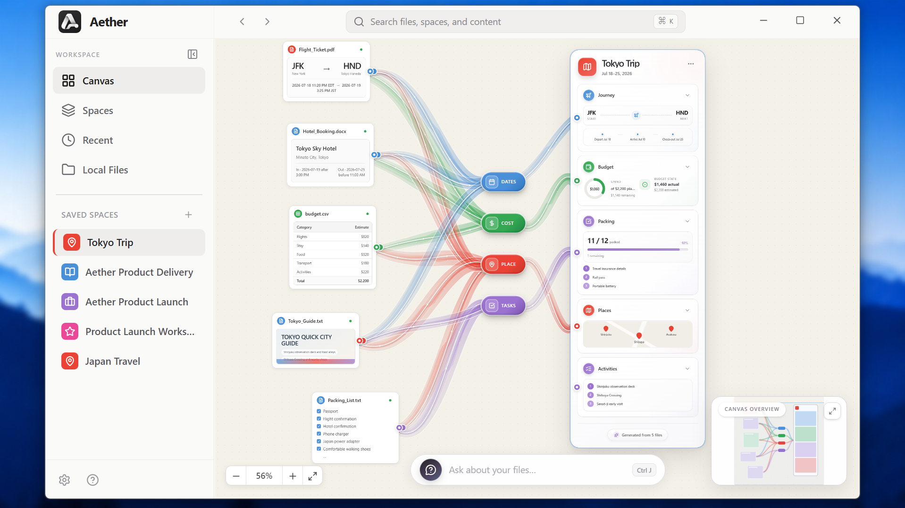
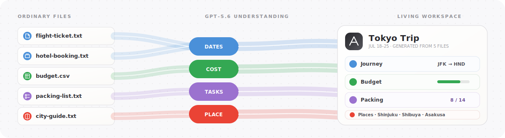

<p align="center">
  
</p>

<h1 align="center">Aether Canvas</h1>

<p align="center">
  <strong>Space is the prompt.</strong><br />
  A generative desktop where grouping ordinary files creates the mini-app you need.
</p>

<p align="center">
  <strong>OpenAI Build Week 2026</strong> &nbsp;·&nbsp;
  Apps for Your Life &nbsp;·&nbsp;
  Built with Codex + GPT-5.6
</p>

<p align="center">
  <a href="#see-aether-in-action"><strong>See the product</strong></a>
  &nbsp;&nbsp;·&nbsp;&nbsp;
  <a href="#run-aether"><strong>Run Aether</strong></a>
  &nbsp;&nbsp;·&nbsp;&nbsp;
  <a href="#how-gpt-56-powers-aether"><strong>GPT-5.6</strong></a>
  &nbsp;&nbsp;·&nbsp;&nbsp;
  <a href="#how-codex-accelerated-the-build"><strong>Build story</strong></a>
</p>

<p align="center">
  
</p>

<p align="center">
  <sub>Five source files, four semantic streams, one GPT-generated interactive workspace—captured from the running Electron app.</sub>
</p>

<!-- Add the public YouTube demo URL beside the product navigation once supplied. -->

<br />

<h2 align="center">Five files in. One living workspace out.</h2>

<p align="center">
  A normal folder sees filenames. Aether sees the trip, project, course, budget, or plan they describe together.
</p>

<p align="center">
  
</p>

<table>
  <tr>
    <td width="33%" valign="top">
      <h3>Space is the prompt</h3>
      <p>Place files together to express intent—without inventing folders, tags, or a perfect prompt first.</p>
    </td>
    <td width="33%" valign="top">
      <h3>Files stay alive</h3>
      <p>Edit the original spreadsheet or note. Aether detects the save, re-analyzes the change, and refreshes the workspace.</p>
    </td>
    <td width="33%" valign="top">
      <h3>Answers show their work</h3>
      <p>Ask across the canvas and see animated traces to the dashboard sections and files that support the answer.</p>
    </td>
  </tr>
</table>

> **The product thesis:** personal files should not become useful only after someone manually reorganizes them. Aether compiles the context already present between them.

## See Aether in action

<table>
  <tr>
    <td align="center" width="20%"><strong>01</strong><br /><sub>DROP</sub></td>
    <td align="center" width="20%"><strong>02</strong><br /><sub>UNDERSTAND</sub></td>
    <td align="center" width="20%"><strong>03</strong><br /><sub>CONNECT</sub></td>
    <td align="center" width="20%"><strong>04</strong><br /><sub>COMPILE</sub></td>
    <td align="center" width="20%"><strong>05</strong><br /><sub>STAY LIVE</sub></td>
  </tr>
  <tr>
    <td valign="top">Add PDFs, sheets, documents, notes, or images.</td>
    <td valign="top">GPT-5.6 extracts dates, costs, places, tasks, and grounded context.</td>
    <td valign="top">Semantic ribbons reveal why the artifacts belong together.</td>
    <td valign="top">The cluster becomes an interactive mini-workspace.</td>
    <td valign="top">External file edits and canvas questions keep it useful.</td>
  </tr>
</table>

### The 90-second product loop

The repository includes a deterministic five-file Tokyo dataset in [`agent_assets/sample-files`](agent_assets/sample-files).

1. Create an empty space and drop in `flight-ticket.txt`, `hotel-booking.txt`, `budget.csv`, `packing-list.txt`, and `city-guide.txt`.
2. Watch the file cards, semantic hubs, ribbons, and Tokyo Trip dashboard assemble.
3. Open Journey, Budget, Packing, and Places—the generated card behaves like a mini-app, not a static summary.
4. Change a value in `budget.csv` externally and save it. The source card and dashboard update without re-importing.
5. Press `Ctrl/⌘ J` and ask **“How much can I spend on food each day?”**
6. Follow the answer’s animated evidence trail back to the supporting files.

> **Demo line:** “Your files aren’t imported into Aether and forgotten. They stay alive.”

## More than a beautiful graph

<table>
  <tr>
    <td width="50%" valign="top">
      <h3>Adaptive mini-workspaces</h3>
      <p>GPT-5.6 plans the dashboard from the actual cluster. Journey, Budget, Packing, Map, Timeline, Progress, Key Points, Priorities, and other modules appear only when grounded in the files.</p>
      <p><strong>Travel is the demo—not the architecture.</strong></p>
    </td>
    <td width="50%" valign="top">
      <h3>Interactive outcomes</h3>
      <p>Edit actual expenses, check packing items, inspect timelines, navigate maps, export data, reveal contributing sources, and preserve those changes with the workspace.</p>
      <p><strong>The output is usable, not merely readable.</strong></p>
    </td>
  </tr>
  <tr>
    <td width="50%" valign="top">
      <h3>Living source files</h3>
      <p>Chokidar watches added files. Stable-write detection, SHA-256 comparison, batching, per-file cooldowns, and request guards prevent partial reads and API storms.</p>
      <p><strong>Aether reacts only to meaningful changes.</strong></p>
    </td>
    <td width="50%" valign="top">
      <h3>Visual explainable AI</h3>
      <p>Answers render as draggable canvas cards. Their colored traces identify the exact generated modules and source files used; low-confidence answers draw no misleading provenance.</p>
      <p><strong>Do not just trust the answer—see its path.</strong></p>
    </td>
  </tr>
</table>

### Built for more than Tokyo

| Put these files together | Aether can compile |
| --- | --- |
| Lecture notes + syllabus + assignment + textbook | Topics, schedule, concepts, progress, resources |
| Requirements + meeting notes + timeline + budget | Overview, milestones, tasks, team, budget |
| Quotes + receipts + floor plan + inspiration | Contractors, spending, materials, timeline, references |
| Recipes + pantry list + dietary notes | Ingredients, cooking timeline, shopping list |
| Lab results + prescriptions + appointment notes | Timeline, medications, appointments, key results |

## How GPT-5.6 powers Aether

GPT-5.6 is not a chat box beside the product. It is the **workspace compiler**.

<table>
  <tr>
    <td width="50%" valign="top">
      <h3>GPT-5.6 decides</h3>
      <ul>
        <li>what each selected file means;</li>
        <li>which entities and relationships matter;</li>
        <li>what kind of workspace the cluster represents;</li>
        <li>which dashboard modules belong in it;</li>
        <li>how changed source data affects the result; and</li>
        <li>which evidence supports a canvas answer.</li>
      </ul>
    </td>
    <td width="50%" valign="top">
      <h3>Aether guarantees</h3>
      <ul>
        <li>secure, user-authorized file access;</li>
        <li>schema validation and bounded inputs;</li>
        <li>a tested local visual component grammar;</li>
        <li>interaction, persistence, and animation;</li>
        <li>provenance ID validation; and</li>
        <li>predictable sync and rate limits.</li>
      </ul>
    </td>
  </tr>
</table>

The model never sends executable interface code to the renderer. It returns a strict plan built from Aether’s local grammar—routes, rings, progress, maps, timelines, briefs, comparisons, priorities, and other tested primitives. GPT-5.6 chooses the information architecture; Aether owns every rendered pixel and interaction.

<details>
  <summary><strong>Open the complete GPT-5.6 runtime flow</strong></summary>
  <br />

```text
User-approved file
        │
        ▼
Electron main process ── MIME detection + secure local read
        │
        ▼
GPT-5.6 Responses API ── native file/image understanding
        │
        ▼
Structured analysis ──── entities, preview, summary, source intelligence
        │
        ├── relationship discovery ──► semantic hubs and ribbons
        │
        └── dashboard planning ──────► bounded local UI composition

External save ──► stable write ──► SHA-256 diff ──► re-analysis
Canvas question ──► validated context ──► answer + provenance
```

Files are sent directly through Responses `input_file` or `input_image`. Structured schemas drive previews, relationship discovery, generated modules, live refreshes, and grounded Q&A.

The default is `gpt-5.6-luna` with low reasoning for a responsive drop loop. Settings expose Terra and Sol plus the supported reasoning levels without requiring a rebuild.

</details>

## Run Aether

### Four commands to the canvas

```bash
git clone git@github.com:abbasmir12/aether-canvas.git
cd aether-canvas
nvm use
npm install
```

```bash
cp .env.example .env
```

On Windows PowerShell:

```powershell
Copy-Item .env.example .env
```

Add the API configuration:

```env
OPENAI_API_KEY=sk-your-key-here
AI_MODEL=gpt-5.6-luna
AI_REASONING_EFFORT=low
```

Then launch:

```bash
npm run dev
```

> **Expected time:** under five minutes on a machine with Node 22 and a working native dependency toolchain.

<details>
  <summary><strong>Prerequisites, commands, and platform notes</strong></summary>
  <br />

**Prerequisites**

- Node.js `>=22.12.0` (`.nvmrc` targets Node 22)
- npm `>=10`
- An OpenAI API key
- A native build toolchain if npm cannot use prebuilt binaries

If native installation falls back to compilation on Debian/Kali:

```bash
sudo apt update
sudo apt install build-essential python3
```

| Command | Purpose |
| --- | --- |
| `npm run dev` | Start Vite and Electron with live rebuilding |
| `npm run lint` | Strictly type-check renderer, shared, main, preload, and configuration code |
| `npm run build` | Type-check, build, rebuild native modules, and package the Linux AppImage |
| `npm start` | Run the previously built Electron bundle |

Development and product testing have been performed on Linux/EC2 and Windows 11. The committed electron-builder target is Linux AppImage; judges on Windows should use `npm run dev`.

The API key can also be entered in **Settings → Intelligence**. A key saved through the UI is protected with Electron `safeStorage`; if OS-backed encryption is unavailable, Aether refuses to persist it as plaintext.

</details>

<details>
  <summary><strong>Supported file input</strong></summary>
  <br />

| Documents | Data | Images |
| --- | --- | --- |
| PDF | Excel (`.xlsx`, `.xls`) | PNG |
| Word (`.docx`) | CSV and TSV | JPEG |
| PowerPoint (`.pptx`) | Plain text and Markdown | GIF and WebP |

Files are limited to 50 MB for direct analysis. Sharp generates local image thumbnails; GPT-5.6 handles semantic understanding.

</details>

## How Codex accelerated the build

The first prompt to Codex did more than request code. It established the product thesis, visual north star, technical constraints, hackathon criteria, documentation system, and a rule: every major milestone must separate **Codex contributions**, **human decisions**, and **verification**.

<table>
  <tr>
    <td width="50%" valign="top">
      <h3>Codex accelerated</h3>
      <ul>
        <li>Electron, Vite, and React Flow scaffolding;</li>
        <li>secure IPC and native path authorization;</li>
        <li>GPT-5.6 Responses and structured schemas;</li>
        <li>dashboard compilation and custom ribbons;</li>
        <li>atomic workspace persistence and recovery;</li>
        <li>live sync, batching, and Windows save handling;</li>
        <li>visual answer nodes and provenance edges; and</li>
        <li>native smoke captures and regression debugging.</li>
      </ul>
    </td>
    <td width="50%" valign="top">
      <h3>The human directed</h3>
      <ul>
        <li>the “Space is the prompt” product thesis;</li>
        <li>native GPT file understanding over parser libraries;</li>
        <li>semantic hubs instead of graph spaghetti;</li>
        <li>living files instead of static imports;</li>
        <li>visual provenance instead of ordinary chat citations;</li>
        <li>the interaction and design quality bar;</li>
        <li>feature priorities and scope; and</li>
        <li>acceptance testing on the real Windows workflow.</li>
      </ul>
    </td>
  </tr>
</table>

> Codex made the week move faster. Human judgment determined what was worth building and repeatedly changed the implementation when the product did not yet express the idea clearly enough.

### The build is inspectable

<table>
  <tr>
    <td width="33%" valign="top">
      <h3><a href="docs/codex-build-log.md">Build log</a></h3>
      <p>What Codex contributed, what the human decided, and how each milestone was verified.</p>
    </td>
    <td width="33%" valign="top">
      <h3><a href="docs/decisions.md">Decision record</a></h3>
      <p>Architecture and product choices, including superseded approaches and why direction changed.</p>
    </td>
    <td width="33%" valign="top">
      <h3><a href="docs/judging-evidence.md">Judging evidence</a></h3>
      <p>Concrete proof mapped to implementation, design, impact, and quality of the idea.</p>
    </td>
  </tr>
  <tr>
    <td width="50%" valign="top" colspan="1">
      <h3><a href="docs/architecture.md">Architecture</a></h3>
      <p>Electron trust boundaries, data flow, local persistence, and renderer structure.</p>
    </td>
    <td width="50%" valign="top" colspan="2">
      <h3><a href="docs/product-spec.md">Product specification</a></h3>
      <p>The user problem, core thesis, target audience, features, and hackathon scope.</p>
    </td>
  </tr>
  <tr>
    <td width="100%" valign="top" colspan="3">
      <h3><a href="build-journey/README.md">Build documentary</a></h3>
      <p>The prompts, milestone recordings, Codex working sessions, and progress screenshots captured throughout the build. The external documentary link will be added before judging.</p>
    </td>
  </tr>
</table>

## Local-first, with an explicit AI boundary

> Aether does not move, rename, or modify source files. Workspace layouts, cached analysis, relationships, dashboard state, pinned folders, and preferences are stored locally as atomic JSON in Electron’s OS-standard application-data directory.

**Local-first does not mean offline-only.** Files explicitly selected through drop or a native picker are sent to the OpenAI Responses API for analysis. Relationship discovery uses the resulting metadata. Local path access is authorized at the preload/main-process boundary, Node integration is disabled in the renderer, and the OpenAI credential never enters renderer code.

<details>
  <summary><strong>Architecture and repository map</strong></summary>
  <br />

```text
┌──────────────── Electron main process ────────────────┐
│ secure file access · OpenAI client · workspace store │
│ file watcher · settings · dialogs · OS integrations  │
└───────────────────────┬───────────────────────────────┘
                        │ typed, prefixed IPC
┌───────────────────────▼───────────────────────────────┐
│ context-isolated preload bridge                      │
└───────────────────────┬───────────────────────────────┘
                        │ window.aether
┌───────────────────────▼───────────────────────────────┐
│ React renderer                                       │
│ React Flow canvas · local UI grammar · Framer Motion │
│ workspaces · interactive dashboard · visual answers │
└───────────────────────────────────────────────────────┘
```

```text
src/
├── main/                 Electron lifecycle, IPC, AI, files, persistence
├── renderer/
│   ├── components/       Canvas, cards, ribbons, dashboards, views
│   ├── hooks/            Auto-layout and renderer behavior
│   ├── services/         Renderer-side orchestration
│   ├── stores/           Workspace and UI state
│   ├── types/            Renderer contracts
│   └── utils/            Shared presentation helpers
└── shared/               Cross-process TypeScript contracts

agent_assets/
├── aether_design.png     North-star product mockup
└── sample-files/         Reproducible Tokyo Trip demo data

docs/                     Build history, decisions, architecture, evidence
build-journey/            Recorded prompts, milestones, and build documentary
```

**Technology:** Electron, TypeScript, React 19, Vite, React Flow, Tailwind CSS, Framer Motion, OpenAI Responses API, Chokidar, Leaflet, Sharp, and electron-builder.

</details>

## Submission

<table>
  <tr>
    <td><strong>Track</strong><br />Apps for Your Life</td>
    <td><strong>Built with</strong><br />Codex using GPT-5.6</td>
    <td><strong>Runtime brain</strong><br />GPT-5.6 Responses API</td>
    <td><strong>Repository</strong><br /><a href="https://github.com/abbasmir12/aether-canvas">GitHub</a></td>
  </tr>
</table>

<br />

<p align="center">
  <br /><br />
  <strong>Aether Canvas</strong><br />
  <sub>Space is the prompt.</sub>
</p>
