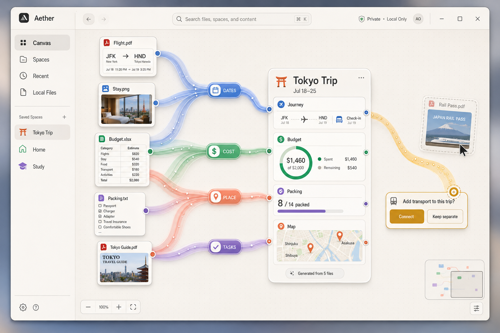

# Aether Canvas


> Space is the prompt.

Aether Canvas is a generative desktop where spatially grouping ordinary files creates the mini-app you need. Drop PDFs, images, spreadsheets, and notes onto an infinite local canvas; Aether understands their contents, draws explainable semantic relationships, and turns coherent clusters into useful summary dashboards.

Built for the OpenAI Build Week **Apps for Your Life** track.

## Status

The complete hackathon product loop is runnable: secure OS file drop, GPT-5.6 native file analysis, semantic hub ribbons, generated interactive dashboard modules, persisted local workspaces, pinned folders, source intelligence, live source-file synchronization, and visual workspace Q&A. Chokidar watches active workspace files; external saves are content-hashed, coalesced, re-analyzed, and reflected in file cards and dashboard metrics without re-importing. `Ctrl/⌘ J` opens “Ask the canvas,” where grounded answers render as draggable cards with animated traces to the exact dashboard modules and files that support them.

Development currently runs on a headless AWS EC2 Linux instance over SSH. Linux/Xvfb checks validate the engineering path, while the human's local Windows PC is the primary product UX and release-test environment. Windows File Explorer drag-and-drop, display scaling, native modules, and packaging must be verified on Windows before submission.

## Setup

Prerequisites:

- Node.js `>=22.12.0` (the repository includes `.nvmrc` for Node 22)
- npm `>=10`
- Python 3, GNU Make, and a C/C++ compiler for native Electron dependencies
- An OpenAI API key once runtime intelligence is implemented

On Debian/Kali Linux, install the native toolchain if needed:

```bash
sudo apt update
sudo apt install build-essential python3
```

Select the repository's Node version and install dependencies:

```bash
nvm use
npm install
npm run lint
```

Configure runtime intelligence:

```bash
cp .env.example .env
# Add your OpenAI API key. Aether defaults to GPT-5.6 Luna with low reasoning.
```

Runtime model settings are environment-configurable:

```env
OPENAI_API_KEY=sk-your-key-here
AI_MODEL=gpt-5.6-luna
AI_REASONING_EFFORT=low
```

Supported GPT-5.6 reasoning efforts are `none`, `low`, `medium`, `high`, `xhigh`, and `max`. Aether calls the quick UI-facing setting “light,” which maps to the API's `low` value. Use `gpt-5.6-terra` for a stronger cost/capability balance or `gpt-5.6-sol` for the hardest quality-first analysis.

The same options are available from **Settings → Intelligence**. `.env` supplies first-run defaults; subsequent user selections are stored in the OS application-data directory. A key entered in Settings is encrypted with Electron `safeStorage` and is never exposed to the renderer. On systems without credential encryption, Aether keeps using `OPENAI_API_KEY` and refuses to persist a plaintext key.

Start Aether:

```bash
npm run dev
```

If a Windows terminal prints VS Code messages such as `StorageMainService`,
`update#setState`, or extension-host output after the Electron bundles build,
the editor was launched instead of Aether. The current Vite configuration
removes inherited VS Code Electron overrides automatically; stop the stale
process, pull the latest commit, and run `npm run dev` again.

Production workflow:

```bash
npm run build
npm start
```

`npm run build` type-checks the main and renderer processes, creates production bundles, rebuilds native dependencies for Electron, and currently packages a Linux AppImage on EC2. A Windows packaging target and Windows-native verification will be added before submission.

### Available commands

| Command | Purpose |
| --- | --- |
| `npm run dev` | Start Vite and the Electron app with live rebuilding |
| `npm run lint` | Strictly type-check renderer, shared, main, preload, and configuration code |
| `npm run build` | Type-check, build, rebuild native modules, and package the app |
| `npm start` | Run the previously built Electron application |

## Sample Data

Deterministic Tokyo Trip placeholders live in `agent_assets/sample-files/`:

- `flight-ticket.txt`
- `hotel-booking.txt`
- `budget.csv`
- `packing-list.txt`
- `city-guide.txt`

These exercise GPT-5.6 native file analysis and relationship discovery before richer demo assets are added. The north-star mockup is `agent_assets/aether_design.png`.

## Tech Stack

- Electron and electron-builder
- Vite, vite-plugin-electron, React, and TypeScript
- React Flow (`@xyflow/react`) for the infinite canvas
- Leaflet + Carto light tiles for generated, interactive location modules
- Chokidar for cross-platform live source-file synchronization
- Tailwind CSS and Framer Motion
- OpenAI GPT-5.6 Responses API for native PDF, spreadsheet, document, text, and image understanding
- `sharp` only for local UI thumbnails
- `better-sqlite3` for local metadata, embeddings, and canvas state
- React Context + `useReducer` for renderer state

## Product Architecture

The intended pipeline is:

```text
File Drop → Authorized local read → GPT-5.6 native file input
                                      ↓
                         Structured analysis JSON
                                      ↓
                      Smart preview React Flow node
                                      ↓
                   Metadata-only relationship discovery
                                      ▲
External save → Chokidar → SHA-256 diff → guarded re-analysis
```

See [`docs/product-spec.md`](docs/product-spec.md) for scope and [`docs/architecture.md`](docs/architecture.md) for the process boundary, IPC design, component tree, and proposed SQLite schema.

## Current Interaction

Drag one or more local files from the operating-system file explorer onto the canvas. Aether authorizes only those explicit paths through the preload bridge, reads their metadata in the main process, and creates FileCard nodes at the spatial drop point. After analysis, the original path remains watched: saving that file in Excel, a text editor, or another desktop app updates Aether automatically. Pan by dragging the open canvas, scroll to pan, use the inset controls to zoom or fit content, and use the topology-aware minimap to navigate files, hubs, dashboards, answers, and their connectors. Settings can switch the signature rich ribbon material to lightweight colored lines without changing semantic relationships.

## Screenshots

_Phase 1 application screenshots and demo media will be added to the repository during the dedicated demo-evidence pass._

Design reference:



## How Codex Was Used

Codex is the primary engineering collaborator for the build. Its contributions and the human decisions that guide or override them are recorded separately after every major milestone in [`docs/codex-build-log.md`](docs/codex-build-log.md). Significant choices are preserved in [`docs/decisions.md`](docs/decisions.md), and concrete proof for the judging criteria is collected in [`docs/judging-evidence.md`](docs/judging-evidence.md).

This separation is deliberate: the final submission will show where Codex accelerated implementation and debugging, while making human product and design judgment visible.

## How GPT-5.6 Powers the Runtime

GPT-5.6 receives the actual file through the Responses API. PDFs contribute extracted text and page images, spreadsheets use native spreadsheet augmentation, text documents are extracted by the API, and images use vision input. JSON Schema output supplies entities, preview content, summaries, and a grounded source-intelligence brief; a second metadata-only call discovers relationships and possible clusters. That call also compiles each dashboard module into a strict, bounded visual composition—such as route plus timeline or progress plus ranked list—which Aether renders through its own safe local component library. “Ask the canvas” sends only the active workspace's analyzed context and bounded text excerpts, then validates the model's schema-constrained answer and provenance IDs before rendering any source traces. External source edits reuse the same analysis contract only after a SHA-256 content change, with cooldown, write-stability, batching, and rate guards to keep runtime cost predictable. This avoids local content parsers and arbitrary model-generated UI while keeping local thumbnail generation and explicit path authorization on-device.

Runtime OpenAI calls will remain in the Electron main process so credentials never enter the renderer. Durable metadata and workspace state stay local in SQLite.

## Privacy

Aether references source files without moving or modifying them and keeps the API key in the Electron main process. When a user drops a supported file, its bytes are sent to the OpenAI Responses API for analysis; relationship discovery sends only the extracted metadata. Durable workspace state remains local. The product UI must clearly disclose this API boundary before submission.
